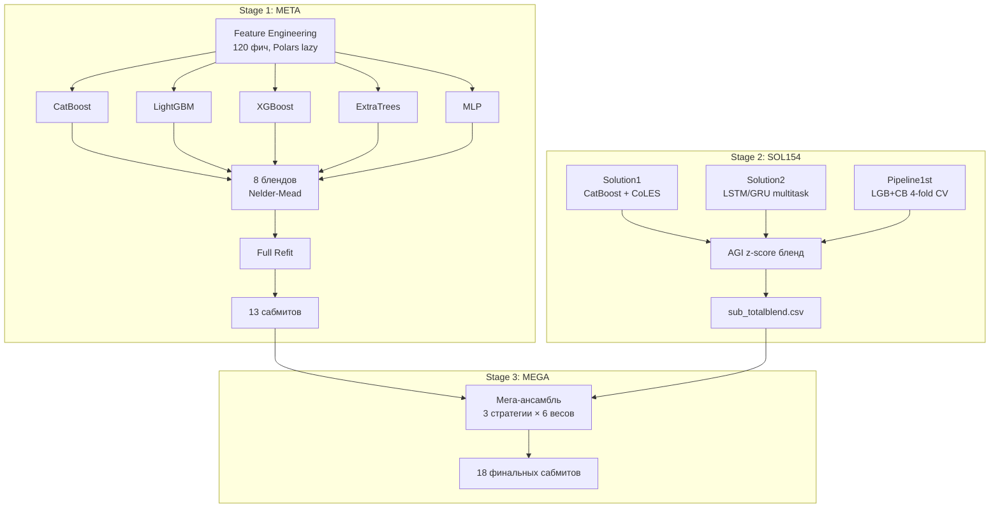

# Data Fusion Guardian

Решение для задачи **"Страж"** соревнования [Data Fusion Contest 2026](https://ods.ai/competitions/data-fusion2026-guardian).

**Лучший скор: 0.15488 PR-AUC** (public leaderboard), **0.15353 PR-AUC** (private leaderboard) — финальный 4-way бленд.

---

## Задача

Классификация банковских операций для системы антифрода. Необходимо предсказать, какие операции **не были подтверждены клиентами** (фрод).

- **Метрика**: PR-AUC (`sklearn.metrics.average_precision_score`)
- **Масштаб**: 200+ миллионов операций, 100 000 клиентов, 1.5 года
- **Дисбаланс классов**: ~1:1000 (51K фродовых операций из ~86M)
- **Классы**:
  - RED (1) — неподтверждённая операция (целевой класс)
  - YELLOW (0) — подозрительная, но подтверждённая клиентом (не целевой, но используется в обучении)
  - GREEN — все остальные операции без обратной связи
- **Лидерборд**: public = недели 1, 3, 5 (30%), private = остальные 7 недель (70%)

---

## Данные

Операции разделены на 4 временных периода:

| Период | Даты | Описание |
|--------|------|----------|
| **Pretrain** | 2023-10 — 2024-09 | История операций без разметки. Для предобучения и извлечения признаков |
| **Train** | 2024-10 — 2025-05 | История с разметкой RED/YELLOW. Основной набор для обучения |
| **Pretest** | 2025-06 — 2025-08 | Тестовая история без разметки. Для построения фич перед классификацией |
| **Test** | 2025-06 — 2025-08 | Финальный день операций каждого клиента (случайный). 633 683 операции для классификации |

Pretrain и train разбиты на 3 части по группам `customer_id`.

### Глоссарий колонок (23 признака)

| # | Колонка | Описание |
|---|---------|----------|
| 1 | `customer_id` | ID клиента банка |
| 2 | `event_id` | ID операции |
| 3 | `event_dttm` | Дата/время операции |
| 4 | `event_type_nm` | Тип операции |
| 5 | `event_desc` | Закодированное описание операции |
| 6 | `channel_indicator_type` | Канал совершения операции |
| 7 | `channel_indicator_subtype` | Подтип канала |
| 8 | `operaton_amt` | Сумма операции в рублях |
| 9 | `currency_iso_cd` | Валюта операции |
| 10 | `mcc_code` | Группа MCC (merchant category code) |
| 11 | `pos_cd` | Point of sale condition code |
| 12 | `accept_language` | Язык заголовка HTTP-запроса |
| 13 | `browser_language` | Язык браузера |
| 14 | `timezone` | Часовой пояс |
| 15 | `session_id` | ID сессии |
| 16 | `operating_system_type` | Операционная система |
| 17 | `battery` | Заряд устройства |
| 18 | `device_system_version` | Версия ОС |
| 19 | `screen_size` | Разрешение экрана |
| 20 | `developer_tools` | Флаг настроек разработчика |
| 21 | `phone_voip_call_state` | Флаг VoIP-звонка во время операции |
| 22 | `web_rdp_connection` | Флаг удалённого управления |
| 23 | `compromised` | Наличие Root-доступа |

---

## Структура репозитория

```
data_fusion_guardian/
│
├── src/                              # Основное решение (модульный пайплайн)
│   ├── main.py                       # Точка входа (--stage meta/sol154/mega)
│   ├── config.py                     # Гиперпараметры всех моделей
│   ├── utils.py                      # Утилиты (блендинг, метрики, даункаст)
│   ├── blend.py                      # Оптимизация 8 блендов (Nelder-Mead)
│   ├── evaluate.py                   # Feature importance + таблица результатов
│   ├── mega_ensemble.py              # Мега-ансамбль (meta + sol154)
│   │
│   ├── features/                     # Feature Engineering
│   │   ├── columns.py                # Определения колонок (76 фич)
│   │   ├── preparation.py            # Оркестратор подготовки данных
│   │   ├── engineering.py            # Построение фич (Polars lazy)
│   │   └── priors.py                 # Каузальные prior-таблицы
│   │
│   ├── models/                       # 5 моделей
│   │   ├── catboost_model.py         # CatBoost (GPU)
│   │   ├── lightgbm_model.py         # LightGBM (CPU)
│   │   ├── xgboost_model.py          # XGBoost (CUDA)
│   │   ├── extratrees_model.py       # ExtraTrees (sklearn)
│   │   └── mlp_model.py              # SimpleMLP (PyTorch)
│   │
│   └── sol154/                       # Альтернативный пайплайн
│       ├── runner.py                 # Оркестратор 4-х шагов
│       ├── agi_blend.py              # 4-step logit z-score бленд
│       ├── config.py                 # Пути sol154
│       ├── solution1/                # CatBoost + CoLES эмбеддинги
│       │   ├── run_catboost.py       # 4-субмодельный ансамбль CatBoost
│       │   ├── run_coles.py          # Обучение CoLES (контрастивное)
│       │   └── run_coles_refit.py    # Refit с CoLES → сабмит
│       ├── solution2/                # Deep Learning
│       │   ├── prepare_data.py       # Подготовка данных
│       │   └── train_last_n_pooling.py  # LSTM/GRU multitask модель
│       └── pipeline1st/              # LGB + CatBoost 4-fold CV
│           └── lgbm_ensemble.py      # Темпоральный бленд
│
├── pipeline.py                       # [эксперимент] CatBoost + FT-Transformer
├── boosting.py                       # [эксперимент] CatBoost + LGB + XGB ансамбль
├── meta3b1n.py                       # [эксперимент] 5-модельный мета-ансамбль
├── train_last_n_pooling.py           # [эксперимент] Секвенциальная модель LSTM/GRU
├── preprocess.py                     # [эксперимент] Предобработка (Polars)
├── prepare_data.py                   # [эксперимент] Подготовка данных (pandas)
│
├── boosting.ipynb                    # [ноутбук] Эксперименты с бустингом
├── meta3b1n.ipynb                    # [ноутбук] Эксперименты с мета-обучением
├── strazh.ipynb                      # [ноутбук] Ранний EDA и baseline
│
├── data/raw/                         # Исходные parquet-файлы
├── cache/                            # Кэш фич и моделей
└── .venv/                            # Виртуальное окружение
```

---

## Архитектура решения

Решение состоит из трёх стадий, запускаемых последовательно:



### Stage 1: META

Основной пайплайн из 5 разнородных моделей:

1. **Feature Engineering** — 120 признаков через Polars lazy API с чанкованием по 3000 клиентов
2. **Обучение 5 моделей** на train/val split (val начинается с 2025-05-01)
3. **Оптимизация 8 комбинаций блендов** через Nelder-Mead
4. **Full refit** каждой модели на полном трейне (итерации × 1.10)
5. **Генерация** 5 индивидуальных + 8 блендовых сабмитов

### Stage 2: SOL154

Альтернативный пайплайн из трёх независимых решений:

| Шаг | Модель | Выход |
|-----|--------|-------|
| Solution1 | CatBoost 4-субмодельный ансамбль + CoLES-эмбеддинги + FB-инъекция | `submission_ICEQ_PUBLIC.csv` |
| Solution2 | LSTM/GRU multitask (3 головы: red, suspicious, red-vs-yellow) | `submission_DL_PUBLIC.csv` |
| Pipeline1st | LightGBM + CatBoost, 4-fold temporal CV, Nelder-Mead | `submission_MINE.csv` |
| AGI Blend | 4-step logit z-score бленд | `sub_totalblend.csv` |

### Stage 3: MEGA

Объединение META и SOL154:
- **3 стратегии**: diverse (CB+ET+MLP+sol154), 2-way (best_blend+sol154), 5models (все+sol154)
- **6 весов** sol154: [0.55, 0.65, 0.75, 0.85, 0.90, 0.95]
- **Метод**: logit → z-score → взвешенная сумма → sigmoid

---

## Feature Engineering

Всего ~120 признаков, организованных в категории:

### Категориальные (15)
`customer_id`, `event_type_nm`, `event_desc`, `channel_indicator_type`, `channel_indicator_sub_type`, `currency_iso_cd`, `mcc_code`, `pos_cd`, `timezone`, `operating_system_type`, `phone_voip_call_state`, `web_rdp_connection`, `developer_tools`, `compromised`, `prev_mcc`

### Суммовые / Amount (8)
`amt`, `amt_log_abs`, `amt_abs`, `amt_is_negative`, `amt_delta_prev`, `amt_to_prev_mean`, `amt_zscore`, `amt_profile_zscore`

### Временные (11)
`hour`, `weekday`, `day`, `month`, `is_weekend`, `is_night`, `hour_sin/cos`, `event_day_number`, `day_of_year`

### Устройство (10)
`battery_pct`, `os_ver_major`, `screen_w/h/pixels/ratio`, `voip_rdp_combo`, `any_risk_flag`, `compromised_devtools`, `lang_mismatch`

### Последовательные / каузальные (20+)
- Кумулятивные счётчики: `cust_prev_events`, `cnt_prev_same_type/desc/mcc/subtype/session`
- Статистики сумм: `cust_prev_amt_mean/std`, `amt_vs_personal_max`
- Временные интервалы: `sec_since_prev_event`, `sec_since_prev_same_type/desc/mcc`
- Изменения: `mcc_changed`, `session_changed`, `os_changed`, `tz_changed`

### Скользящие окна / Velocity (12)
`cnt_15min`, `cnt_1h`, `cnt_6h`, `cnt_24h`, `cnt_7d`, `amt_sum_15min/1h/24h`, `burst_ratio_1h_24h`, `spend_concentration_1h`

### Prior fraud ratios (22)
`prior_{col}_cnt/red_rate/red_share` для 7 категориальных колонок + 4 интеракционные пары. Строятся каузально (только на данных до cutoff).

### Фидбек-фичи (14, только FB-модель)
`cust_prev_red/yellow_lbl_cnt`, `rates`, `flags`, `sec_since_prev_red/yellow_lbl`, per-desc/channel counts. Только для ~40% клиентов с историей меток.

### Фичи детекции типов фрода (15)
- **Социальная инженерия**: `voip_cnt_15min`, `had_voip_before_txn`, `is_round_amount`
- **Кража карты**: `unique_mcc_1h/24h`, `mcc_scatter_ratio`, `tz_jump_magnitude`, `impossible_travel`
- **Изменение поведения**: `hour_drift`, `amt_drift_5`, `mcc_diversity_ratio`

### CoLES-эмбеддинги (256)
`coles_0` ... `coles_255` — 256-мерный поведенческий вектор клиента, обученный контрастивно на 177M событиях.

### Паттерны пропусков (11)
`null_{col}` для 10 device-колонок + `null_device_count`. Пропуски = сигнал о типе платформы.

### Профили из претрейна (9)
`profile_txn_count`, `profile_amt_mean/std/median/max/p95`, `amt_over_profile_mean/p95`, `amt_profile_zscore`

---

## Модели

| Модель | Iterations | LR | Ключевые параметры | Устройство |
|--------|-----------|-----|-------------------|------------|
| **CatBoost** | 6 000 | 0.04 | depth=8, l2_leaf_reg=10, early_stop=300 | GPU |
| **LightGBM** | 6 000 | 0.03 | num_leaves=255, min_child=80, subsample=0.8 | CPU |
| **XGBoost** | — | 0.04 | max_depth=8, reg_lambda=10, tree_method=hist | CUDA |
| **ExtraTrees** | 200 | — | max_depth=16, balanced_subsample, max_features=sqrt | CPU |
| **MLP** | 20 epochs | 1e-3 | hidden=[256,128], dropout=0.2, batch=4096, AMP | GPU |

### 4-субмодельный CatBoost (Solution1)

| Субмодель | Таргет | Данные | Назначение |
|-----------|--------|--------|------------|
| MAIN | RED=1 vs rest | Весь сэмплированный трейн | Основной предсказатель |
| SUSPICIOUS | RED+YELLOW=1 vs GREEN | Весь сэмплированный трейн | «Подозрительна ли операция?» |
| RED\|SUSP | RED=1 vs YELLOW=0 | Только размеченные | «Если подозрительная — RED?» |
| FEEDBACK | RED=1 vs rest | Все (с FB-фичами) | Использует историю меток клиента |

---

## Блендинг

### 8 комбинаций (Stage 1)

`cb_lgb`, `cb_xgb`, `lgb_xgb`, `3boost`, `3boost_et`, `3boost_mlp`, `all5`, `et_mlp`

Оптимизация весов через Nelder-Mead с softmax-параметризацией на валидационном PR-AUC.

### AGI бленд (Stage 2)

4-step цепочечный бленд:
```
DL + ICEQ → BLEND1 (w=0.55)
BLEND1 + MINE → BLEND2 (w=0.55)
BLEND2 + BLEND1 → BLEND4 (w=0.5485)
BLEND1 + BLEND4 → sub_totalblend (w=0.5414)
```

Для каждой пары: `logit(p)` → z-score нормализация → взвешенная сумма → `sigmoid`.

### Мега-ансамбль (Stage 3)

Rank normalization всех предсказаний, затем logit-zscore блендинг 7 источников (5 моделей + лучший бленд + sol154) по 3 стратегиям.

---

## Ключевые идеи решения

### Feedback-инъекция
Для ~40% клиентов с историей размеченных событий предсказание отдельной FB-модели подмешивается через rank-averaging. Самый большой буст на лидерборде (+0.015 LB).

### Product decomposition
Разделение задачи: `P(RED) = P(подозрительная) × P(RED|подозрительная)`. Два более простых таргета вместо одного: модель SUSPICIOUS определяет подозрительность, модель RED|SUSP — фрод среди подозрительных. Их произведение комбинируется с основной моделью MAIN.

### CoLES (Contrastive Learning for Event Sequences)
GRU-энкодер обучается контрастивно на 177M событиях: две случайные подпоследовательности одного клиента = положительная пара, разные клиенты = отрицательная. Результат — 256-мерный поведенческий отпечаток клиента, используемый как фичи в CatBoost.

### Строгая каузальность
Все фичи строятся без заглядывания в будущее: `.shift(1)` для expanding-агрегаций, `closed="left"` для скользящих окон, prior-таблицы строятся только на данных до validation cutoff.

### Null как сигнал
~90% пропусков в device-фичах означают мобильное приложение (vs веб-версия). Мобильные операции показывают более высокий уровень фрода (61.5% vs 33% среди размеченных). Пропуски кодируются отдельными флагами.

### Rank-based блендинг
Ранговая нормализация предсказаний вместо сырых вероятностей или geometric mean. Rank-average корректно работает с PR-AUC, в отличие от geometric mean, который сжимает ранжирование и убивает precision.

### Negative sampling
Разная интенсивность сэмплирования для зелёных (неразмеченных) событий: свежие (после 2025-04-01) сохраняются 1:5, старые — 1:15. Все RED и YELLOW всегда сохраняются. Позволяет обучаться на ~3M строк вместо 86M без потери сигнала.

---

## Результаты

| Решение | Public LB | Подход |
|---------|-----------|--------|
| **Final 4-way blend** | **0.1549** | CatBoost+CoLES + LSTM/GRU + LGB/CB + AGI z-score |
| CatBoost + CoLES + FB | 0.1414 | 4-субмодельный CatBoost + CoLES-эмбеддинги + feedback-инъекция |
| CB ensemble + FB | 0.1384 | CatBoost без CoLES |
| DL LSTM multitask | 0.1318 | Нейросетевое sequence-based решение |
| Базовый CatBoost | 0.118 | CatBoost без FB-инъекции |

---

## Быстрый старт

### Установка зависимостей

```bash
pip install polars catboost lightgbm xgboost torch scikit-learn scipy numpy pandas tqdm joblib
```

### Данные

Поместите файлы соревнования в `data/raw/`:
```
data/raw/
├── pretrain_part_1.parquet
├── pretrain_part_2.parquet
├── pretrain_part_3.parquet
├── train_part_1.parquet
├── train_part_2.parquet
├── train_part_3.parquet
├── train_labels.parquet
├── pretest.parquet
└── test.parquet
```

### Запуск пайплайна

```bash
# Все 3 стадии последовательно
python -m src.main

# Отдельные стадии
python -m src.main --stage meta     # 5 моделей + 8 блендов → 13 сабмитов
python -m src.main --stage sol154   # CatBoost+CoLES + DL + LGB/CB → sub_totalblend
python -m src.main --stage mega     # Мега-ансамбль meta + sol154 → 18 сабмитов
```

Результаты сохраняются в `submission_meta/`.

---

## Эксперименты (корневые файлы)

Файлы вне `src/` — скрипты и ноутбуки с экспериментами, предшествовавшими финальному решению:

| Файл | Описание |
|------|----------|
| `pipeline.py` | Основной экспериментальный пайплайн: feature engineering + CatBoost + FT-Transformer |
| `boosting.py` / `boosting.ipynb` | Ансамбль CatBoost + LightGBM + XGBoost с Nelder-Mead блендингом |
| `meta3b1n.py` / `meta3b1n.ipynb` | 5-модельное мета-обучение (CB, LGB, XGB, ExtraTrees, MLP) |
| `train_last_n_pooling.py` | Секвенциальная LSTM/GRU модель с last-N pooling и multitask-обучением |
| `strazh.ipynb` | Ранний EDA и baseline-эксперименты |
| `preprocess.py` | Предобработка данных через Polars (типы, фичи, дедупликация) |
| `prepare_data.py` | Legacy-скрипт подготовки данных через pandas |

---

## Зависимости

- **Data**: `polars`, `pandas`, `numpy`
- **Models**: `catboost`, `lightgbm`, `xgboost`, `scikit-learn`, `torch`
- **Optimization**: `scipy`
- **Utils**: `tqdm`, `joblib`

Python 3.10+

---

*Data Fusion Contest 2026 · anti-fraud / PR-AUC*
